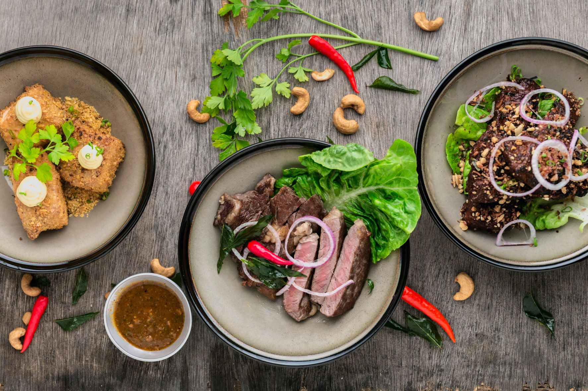

# Essen auf Rädern 

Photo by <a href="https://unsplash.com/@lvnatikk?utm_source=unsplash&utm_medium=referral&utm_content=creditCopyText">Lily Banse</a> on <a href="https://unsplash.com/s/photos/meal?utm_source=unsplash&utm_medium=referral&utm_content=creditCopyText">Unsplash</a>

## Szenario
Sie beliefern Kunden mit warmen Mittagessen. Ihre Hauptkunden sind Senioren und Seniorenheime, die zwischen 11:30 und 13:30 beliefert werden. Täglich haben Sie drei Gerichte zur Auswahl:

* 1 Suppe des Tages (vegetarisch)
* 2 Einfaches Menü (Hauptgericht + Beilage)
* 3 Premiummenü (Exklusives Hauptgericht + Beilage + Dessert)

Ihre drei Fahrzeuge möchten Sie so effizient wie möglich einsetzen und dabei so wenig Zeit wie möglich auf der Straße verbringen, um den Kunden ein warmes Mittagessen zu garantieren.

## Lösung mit MultiRoute Tour!
Je nach Anforderung gibt es verschiedene Wege, um mit MultiRoute Tour! hier wortwörtlich ans Ziel zu kommen. 

Eine gute Lösung sähe wie folgt aus:

* Geben Sie sich aus Ihrem CRM täglich die Liste der Bestellungen als Excelliste aus. Diese sollte neben den Adressinformationen auch das gewählte Menü (1,2 oder 3) enthalten. 
* Damit Ihre Essen auch warm ankommen, fahren Sie am besten in zwei Schichten, von 11:30-12:30 Uhr und von 12:30-13:30 Uhr.
* Die Wunschzeit können Sie bei den Kunden hinterlegen. Je nach Kundenbedarf, können Sie das Wunsch-Anlieferungszeitfenster vergrößern oder verkleinern. Beachten Sie aber, dass natürlich nicht alle Kunden um die gleiche Uhrzeit beliefert werden können.

|Straße Hausnummer|PLZ| Ort | Menü-Notizen | Belieferungszeitfenster Start| Belieferungszeitfenster Ende |
|---|---|---|---|---|---|
|Hauptstraße 10| 21614 | Buxtehude | 1 | 11:30 | 12:00 |
|Bahnhofsweg 11| 21614 | Buxtehude | 1 | 11:45 | 12:30 |
|Amselgasse 20| 21614 | Buxtehude | 3 | 12:45 | 13:15 |
|Eichenweg 33| 21614 | Buxtehude | 2 | 12:30 | 13:30 |

MultiRoute Tour! berechnet Ihnen nun für Ihre Flotte von 3 Fahrzeugen mit 2 Schichten automatisch 6 verschiedene Strecken unter Berücksichtigung der angegebenen Belieferungszeitfenster. Sie können die Excellisten für die beiden Schichten exportieren und an die Küche weitergeben, die die Menüs entsprechend zubereitet. 

Die Fahrer erhalten jeweils den [Google-Maps-Export](/tour/#tour-exportieren) und können mit Ihrem Handy losnavigieren.