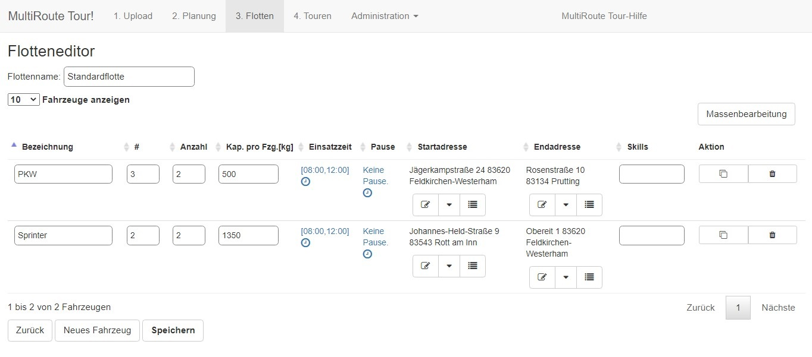
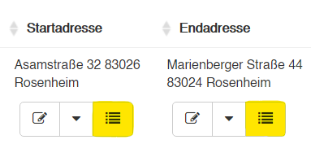
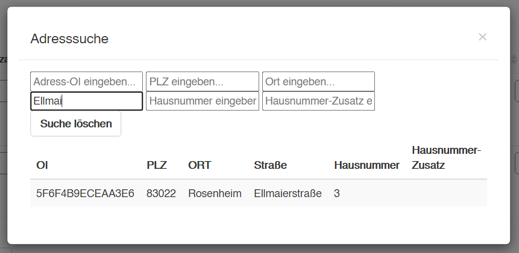

# **3. Flotten**

In den Flotten legen Sie fest, welche Fahrzeuge Sie im Einsatz haben.

## Fahrzeugparameter

- Als **Bezeichnung** wird von den meisten Kunden entweder Fahrzeugtyp (PKW, LKW, Sprinter etc.), Kennzeichen (M-KR-2010) oder Fahrername (Thomas) gewählt. 
- Die Spalte mit der kleinen Raute, die sogenannte **Streckenzuordnung**, dient der Sortierung der Fahrzeuge. Diese können Sie in der Regel einfach ignorieren. 
- Die **Anzahl** gibt an, wie viele Fahrzeuge Sie von dem jeweiligen Typ zur Verfügung haben. MultiRoute Tour! wird Ihnen die Fahrzeuganzahl berechnen, die optimal ist, um möglichst wenige Kilometer zu fahren, d.h. es werden nicht automatisch alle Fahrzeuge die hier angegeben werden, genutzt.
- Die **Kapazität** gibt an, welches Fassungsvermögen in Stück oder kg der jeweilige Fahrzeugtyp hat.
- Die **Einsatzzeit** können Sie beliebig anpassen. 
- Bei **Pausen** können Sie genau eine Pause berücksichtigen lassen.
- Die **Start- und Endadresse** können beliebig wählen. Die Adresse muss nur im System vorhanden sein und vorher entweder hochgeladen oder manuell gesetzt worden sein. 
- Die **Skills** beziehen sich auf die Skills die Sie ggf. hochgeladen haben. Hier würde nun auch entsprechend "Kühlfahrzeug" oder "mit Hebebühne" angegeben werden. 
- In der **Aktionsspalte** können Sie den Fahrzeugtypen klonen oder löschen.

## Start- und Endadresse definieren

!!! info "Achtung"

    Die Adresse muss vorher einmal in MultiRoute Tour! hochgeladen oder angelegt worden sein. 
    Finden Sie Ihre Adresse hier nicht, erledigen Sie dies ganz einfach mit drei Klicks. 
    Dies ist [hier](/tipps/#adressen-neu-anlegen) erklärt.
    
Möchten Sie eine Start- oder Endadresse für die Fahrzeuge suchen, klicken Sie auf das Listensymbol (gelb markiert). 

Es öffnet sich eine Suchmaske in der Sie bspw. den Straßennamen eingeben. 

Wenn Sie auf die entsprechende Adresse klicken, ist diese eingetragen. Vergessen Sie am Ende nicht, die Flotte zu speichern! 

