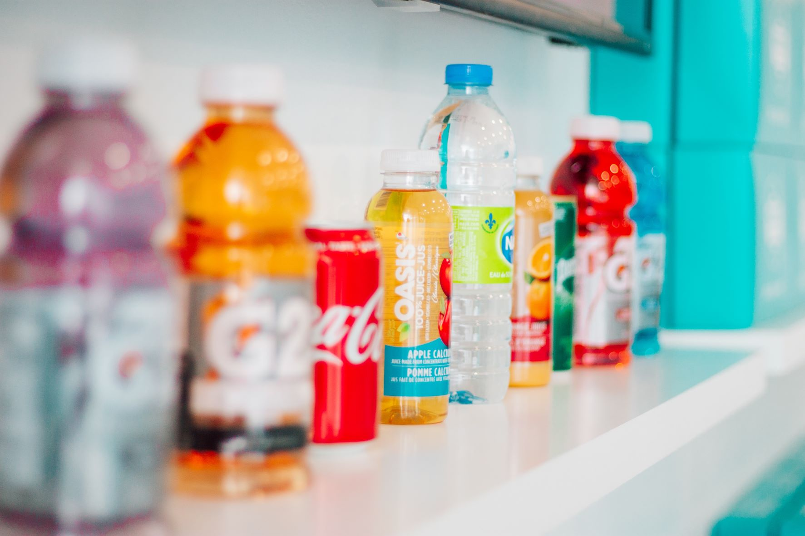

# Getränkelieferungen

Photo by <a href="https://unsplash.com/@itsmaemedia?utm_source=unsplash&utm_medium=referral&utm_content=creditCopyText">Shayna Douglas</a> on <a href="https://unsplash.com/s/photos/beverages?utm_source=unsplash&utm_medium=referral&utm_content=creditCopyText">Unsplash</a>

## Szenario
Sie sind ein Getränkelieferdienst und möchten Ihre Touren so effizient wie möglich gestalten. Ihre Fahrzeuge möchten Sie so gut wie möglich auslasten.
Sie haben Großkunden aber auch kleinere Supermärkte und die Gastronomie unter Beachtung spezieller Öffnungszeiten zu beliefern.

## Lösung mit MultiRoute Tour!

|Straße Hausnummer|PLZ| Ort | kg | Belieferungszeitfenster Start| Belieferungszeitfenster Ende |
|---|---|---|---|---|---|
|Hauptstraße 10| 21614 | Buxtehude | 100 |  |  |
|Bahnhofsweg 11| 21614 | Buxtehude | 700 | 11:45 | 12:30 |
|Amselgasse 20| 21614 | Buxtehude | 1000 |  | |
|Eichenweg 33| 21614 | Buxtehude | 300 | 12:30 | 13:30 |

Der Schlüssel sind hier die Kapazitäten Ihrer Fahrzeuge. Diese müssen vorher definiert werden und sollten am besten einen kleinen Puffer beeinhalten. Haben Sie Ihre Flotte erstellt, können Sie Ihre Touren mit einem Klick berechnen! 

Die Fahrer erhalten jeweils den [Google-Maps-Export](/tour/#tour-exportieren) und können mit Ihrem Handy losnavigieren.