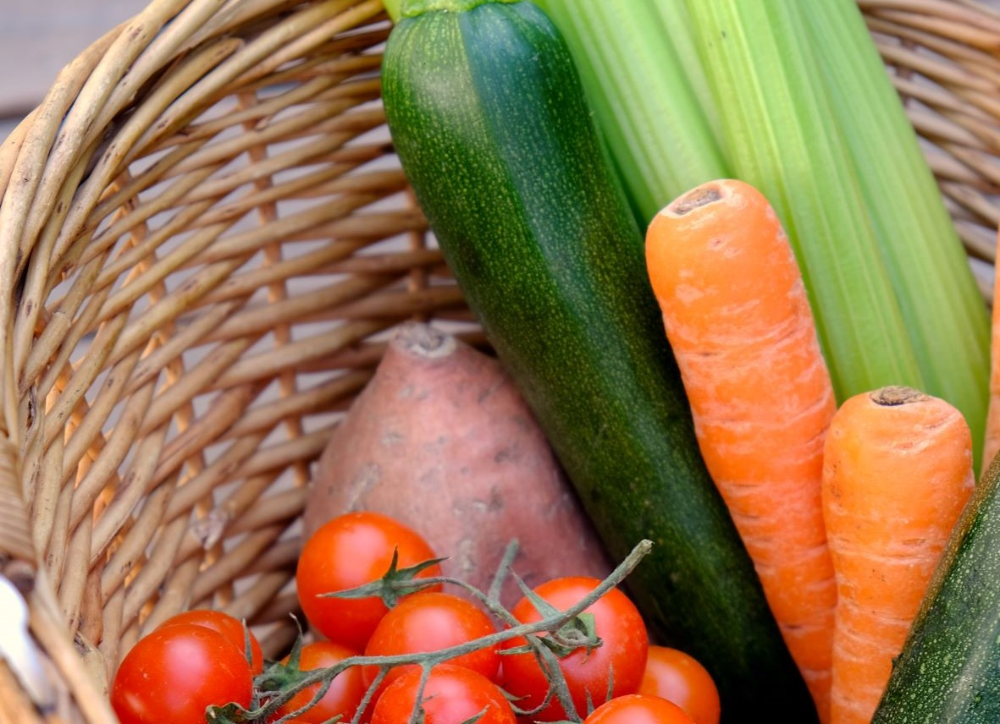

# Lieferkisten 

Photo by <a href="https://unsplash.com/@sarascarpa?utm_source=unsplash&utm_medium=referral&utm_content=creditCopyText">Sara Scarpa</a> on <a href="https://unsplash.com/?utm_source=unsplash&utm_medium=referral&utm_content=creditCopyText">Unsplash</a>

## Szenario
Sie beliefern Kunden einmal die Woche mit regionalen Obst- und Gemüsekisten. Für alle Kunden gibt es diese in der gleichen Ausführung.
Sie haben 3 Fahrzeuge im Einsatz, die die Kisten einmal die Woche Ihren Kunden vor die Haustüre stellen.

## Lösung mit MultiRoute Tour!

|Straße Hausnummer|PLZ| Ort | Anzahl | Belieferungszeitfenster Start| Belieferungszeitfenster Ende |
|---|---|---|---|---|---|
|Hauptstraße 10| 21614 | Buxtehude | 1 |  |  |
|Bahnhofsweg 11| 21614 | Buxtehude | 1 | 11:45 | 12:30 |
|Amselgasse 20| 21614 | Buxtehude | 2 |  | |
|Eichenweg 33| 21614 | Buxtehude | 1 | 12:30 | 13:30 |

Sie können die Anzahl der Kisten pro Haushalt als auch eine gewünschte Empfangszeit in MultiRoute Tour! hochladen. Wenn Sie Ihre Flotte angelegt haben, können Sie die Touren sofort optimieren.

Möchten Sie die Lieferung auf mehrere Tage aufteilen, können Sie diese Szenarien mit wenigen Klicks durchspielen und vergleichen. 

Die Fahrer erhalten jeweils den [Google-Maps-Export](/tour/#tour-exportieren) und können mit Ihrem Handy losnavigieren.