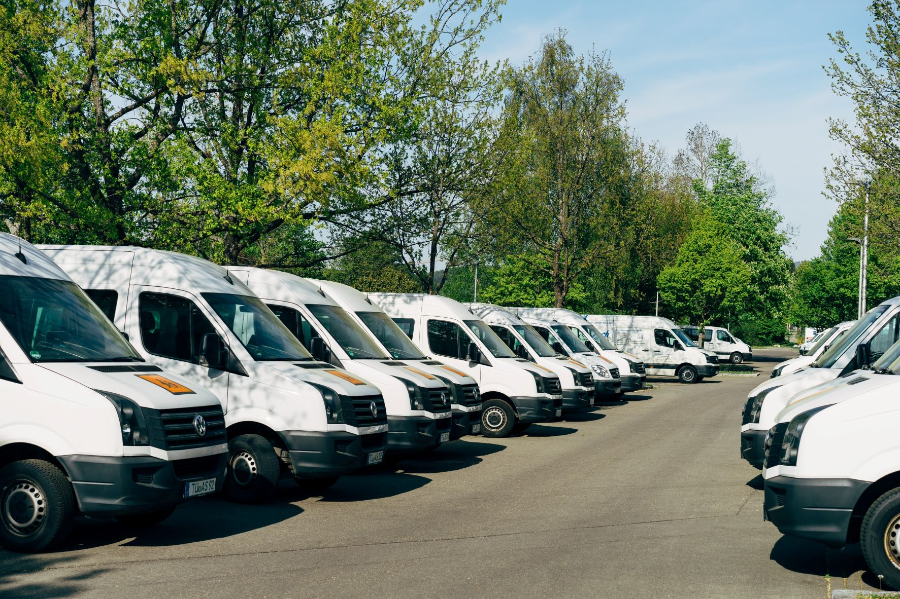

# Spediteur

Photo by <a href="https://unsplash.com/@markuswinkler?utm_source=unsplash&utm_medium=referral&utm_content=creditCopyText">Markus Winkler</a> on <a href="https://unsplash.com/s/photos/fleet?utm_source=unsplash&utm_medium=referral&utm_content=creditCopyText">Unsplash</a>

## Szenario
Ein Spediteursunternehmen optimiert täglich seine Touren. Es muss dabei alle Kundenaufträge optimal auf seine festangestellte Flotte von 2 LKW und 2 Sprintern sowie 2 Caddy-Springern, die nur nach Bedarf eingesetzt werden.
Es hat pro Tag rund 500 Aufträge, die sich im auszuliefernden Gewicht stark unterscheiden. 

## Lösung mit MultiRoute Tour!

Täglich werden die zu beliefernden Kunden aus dem CRM als Excelliste exportiert. 

|Straße Hausnummer|PLZ| Ort | Kundenname | kg| Öffnungszeit Start| Öffnungszeit Ende |
|---|---|---|---|---|---|---|
|Hauptstraße 10| 21614 | Buxtehude | Edeka | 100| | |
|Bahnhofsweg 11| 21614 | Buxtehude | Rossmann | 200 | | |
|Amselgasse 20| 21614 | Buxtehude | Müller & co. | 50 | 08:30 | 12:30 |
|Eichenweg 33| 21614 | Buxtehude | Danny's | 700 | 09:00 | 10:30 |
|...|...|...|...|...|...|...|

* Es wird zunächst versucht, alle Aufträge mit der **festangestellten Flotte** zu erledigen.
* Klappt dies, so können die Aufträge auch gleichmäßig auf alle Fahrzeuge aufgeteilt werden.
* Falls Aufträge übrig bleiben, kann mit einem Klick mit der **festangestellen Flotte + Springer** optimiert werden.

Die Fahrer erhalten jeweils den [Google-Maps-Export](/tour/#tour-exportieren) und können mit Ihrem Handy losnavigieren.