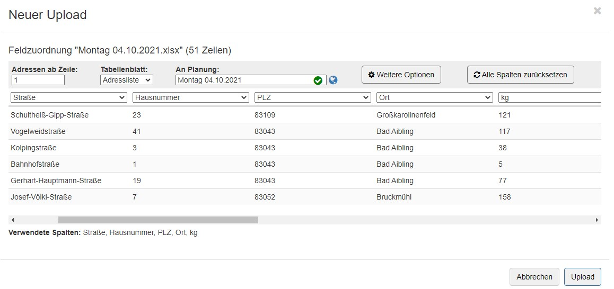

# **1. Upload**

Musterdateien zum Download: 

- 💾 [Musterliste](assets/downloads/Muster-Upload.xlsx)
- 💾 [Musterliste mit allen optionalen Spalten](assets/downloads/Muster-Upload-erweitert.xlsx)

## Einfachste Variante

In MultiRoute Tour! können Sie Exceltabellen oder csv-Dateien (mit beliebigem Trennzeichen) hochladen. 
Für den einfachsten Fall benötigen Sie nur eine Tabelle mit Adressinformationen. In diesem Muster sind bspw. vier Spalten enthalten mit Straße, Hausnummer, PLZ, Ort. Sie können Straße und Hausnummer aber auch direkt in eine Spalte schreiben. Selbiges gilt für PLZ und Ort. Falls vorhanden können Sie ebenfalls noch eine zusätzliche Spalte für Hausnummernzusatz oder Ortszusätze hinzufügen. Wenn Sie mit Koordinaten arbeiten, können Sie diese ebenfalls hochladen.

💾 [Musterliste](assets/downloads/Muster-Upload.xlsx)

## Zusätzliche optionale Spalten

Die notwendigen Spalten sind blau markiert, die optionalen orange. 

Neben einem Gewicht oder eine Stückzahl, können Sie ein oder mehrere Auftragszeitfenster festlegen. Diese können die Öffnungszeit(en) Ihres Kunden widerspiegeln. Sie können ebenfalls eine Auftragsbezeichnung und Notizen vergeben, die auf den Export-Dokumenten nach der Tourenberechnung wieder auftauchen. 

Mithilfe der Skills können Sie Besonderheiten abbilden, wenn ein Auftrag bspw. ein Kühlfahrzeug benötigt, sie aber eine heterogene Flotte von "normalen" Fahrzeugen und Kühlfahrezugen haben. Diese Skills werden ebenfalls in der Flotte eingegeben und den oder dem entsprechenden Fahrzeug(en) zugeordnet. 

💾 [Musterliste mit allen optionalen Spalten](assets/downloads/Muster-Upload-erweitert.xlsx)

## Upload in MultiRoute Tour!

In MultiRoute Tour! klicken Sie auf **1. Upload** und wählen Ihre Datei aus. Anschließend müssen Sie die Spalten Ihrer Datei auswählen, die von MultiRoute Tour! berücksichtigt werden sollen. 
Der Dateiname wird standardmäßig als Planungsbezeichnung genommen. Diese können Sie im Feld "An Planung" manuell nach Belieben anpassen, bspw. zu "Montag 04.10.2021".

